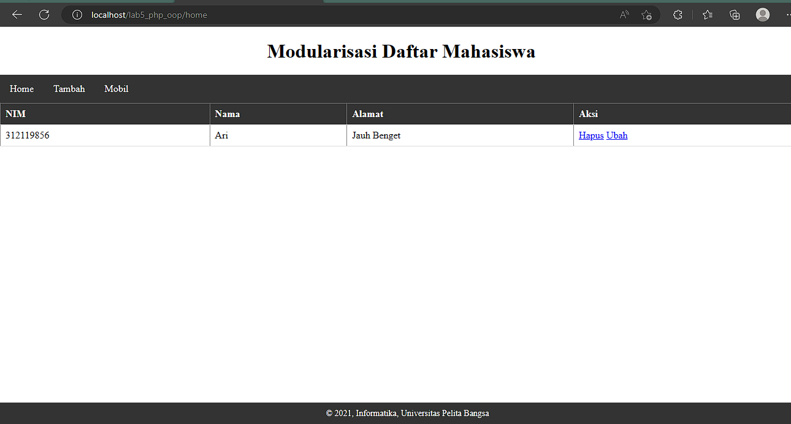
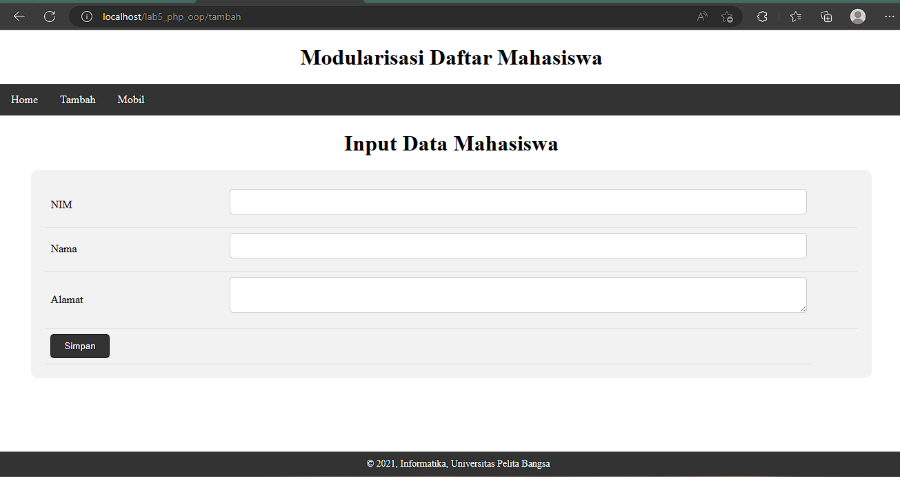
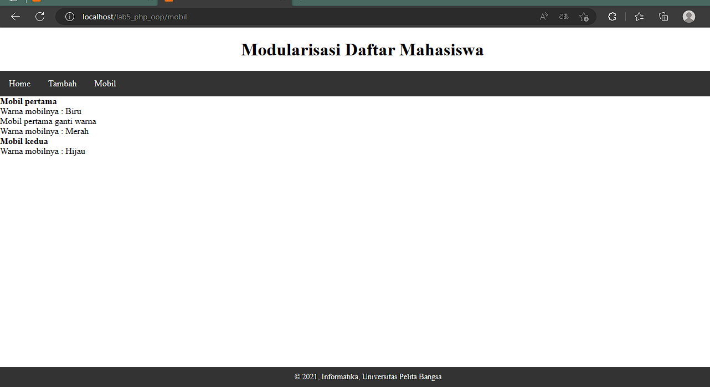
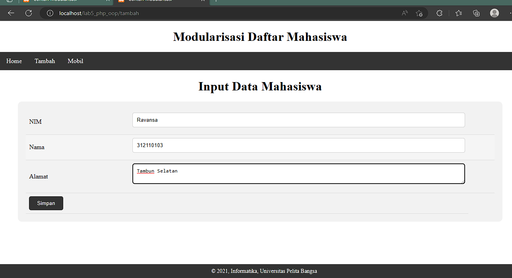
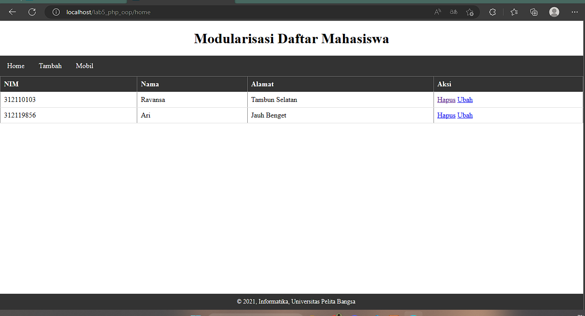

# PHP-OOP
# PHP-Dasar

This project is an assignment from my class
#### NAMA : Ravansa Rahman Santosa
#### NIM : 312110103
#### Kelas : TI.21.A2
#### MatKul : Pemrograman Weh 2

### Latihan
## Membuat Routing
### Routing digunakan untuk mempermudah akses halaman web agar SEO Friendly
### Menggunakan .htaccess
```
<IfModule mod_rewrite.c>
 RewriteEngine On
 RewriteBase /lab5_php_oop/
 RewriteCond %{REQUEST_FILENAME} !-f
 RewriteCond %{REQUEST_FILENAME} !-d
 RewriteRule ^home/?$ home.php [L]
 RewriteRule ^tambah/?$ tambah.php [L]
 RewriteRule ^mobil/?$ mobil.php [L]
</IfModule>

```
### Hasil routing


### Tugas Mobil

### Test Penginputan data


